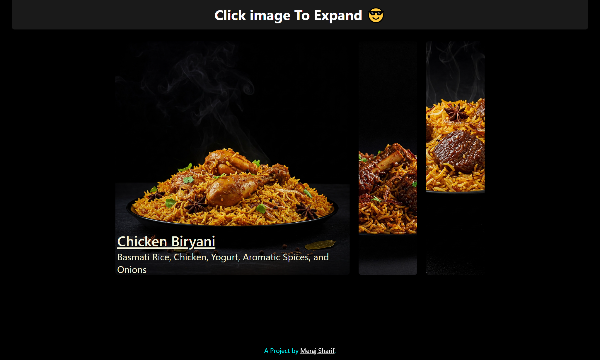

# ClickExpand
## A JavaScript Project That allows user to expand the image and see full content.

## Table of contents

- [Screenshot](#screenshot)
- [Links](#links)
- [Built with](#built-with)
- [Author](#author)

### Screenshot

### Links

- Project Live URL: [Live URL](https://meraj-sharif-khan.github.io/clickExpand/)
- My Portfolio URL: [Portfolio URL](https://merajsharif.netlify.app/#project)

### Built with

- HTML
- CSS
- JavaScript
- Semantic HTML5 markup
- Mobile-first workflow
- BEM

## Author

- Linkedin - [@MerajSharif](https://www.linkedin.com/in/meraj-sharif-0413a6264/)
